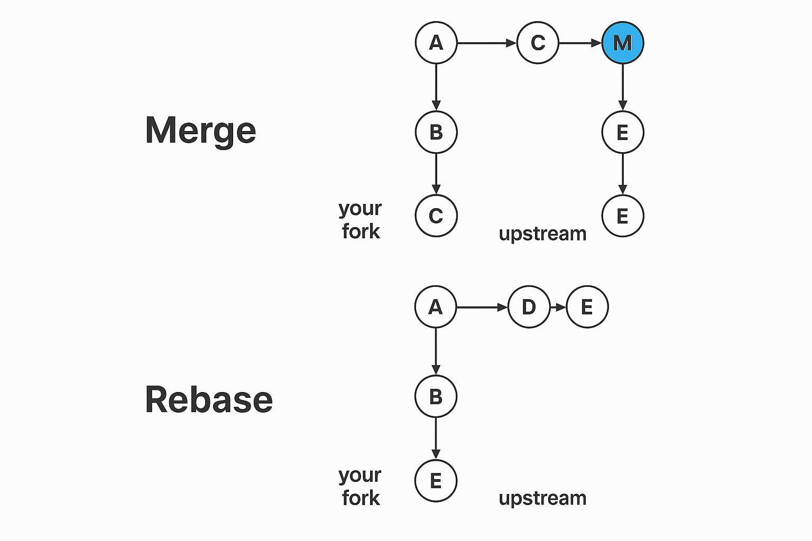

Great question! Understanding **merge vs rebase** is key to choosing the right workflow. Let me break it down in simple, practical terms:

***

### **1. Merge**

*   **What it does:** Combines changes from one branch (e.g., `upstream/main`) into your branch by creating a **new commit** called a *merge commit*.
*   **History result:** Keeps the full history of both branches. You’ll see a commit graph with branches joining together.
*   **Pros:**
    *   **Safe and simple**: Your existing commits stay intact.
    *   Good when you’ve made local changes and want to preserve them as-is.
*   **Cons:**
    *   History can look “messy” because of extra merge commits.
*   **Command:**
    ```bash
    git merge upstream/main
    ```

**Visual:**

    Before merge:
    A---B---C (your fork)
             \
              D---E (upstream)

    After merge:
    A---B---C-------M (merge commit)
                     \
                      D---E

***

### **2. Rebase**

*   **What it does:** Moves your commits **on top of** the upstream branch, as if you started from the latest upstream version.
*   **History result:** Linear, clean history—no merge commits.
*   **Pros:**
    *   Looks neat and easy to follow.
    *   Great for projects where clean history matters.
*   **Cons:**
    *   **Risky if you’ve made local changes**: If upstream changed the same lines you did, you’ll hit conflicts during rebase.
    *   Rewrites commit history (not a problem if you’re the only one working on your fork).
*   **Command:**
    ```bash
    git rebase upstream/main
    ```

**Visual:**

    Before rebase:
    A---B---C (your fork)
             \
              D---E (upstream)

    After rebase:
    A---B---D---E---C (linear history)

***

### **Which should you use?**

*   **Merge** → Safer for your workflow because you’ll occasionally modify tutorials locally. It preserves your changes without rewriting history.
*   **Rebase** → Use if you want a clean history and you’re comfortable resolving conflicts when they occur.

***

✅ **Rule of thumb:**

*   If you’re just pulling updates and don’t care about a perfectly clean history → **merge**.
*   If you want a neat history and are okay with occasional conflict resolution → **rebase**.

***


Here’s a visual comparison:



Merge (top): Your fork and upstream remain separate histories, joined by a merge commit (M). This preserves all commits but adds an extra node.
Rebase (bottom): Your commits are moved on top of upstream, creating a straight line. No merge commit, but your commit history is rewritten.

✅ Merge = safer, keeps history intact.
✅ Rebase = cleaner, but can cause conflicts if both changed the same lines.

